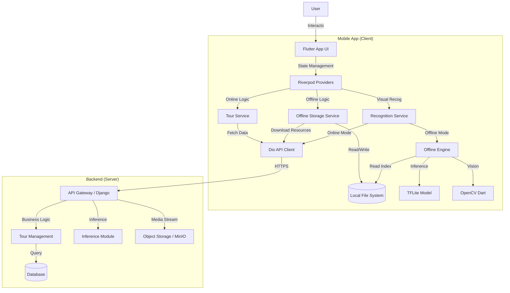
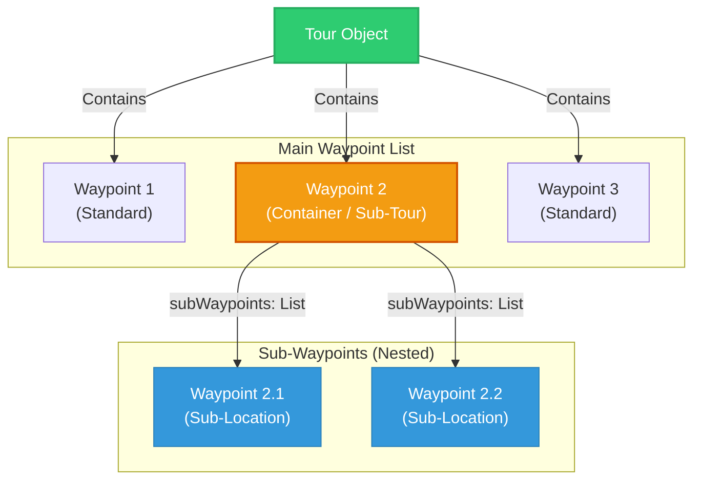
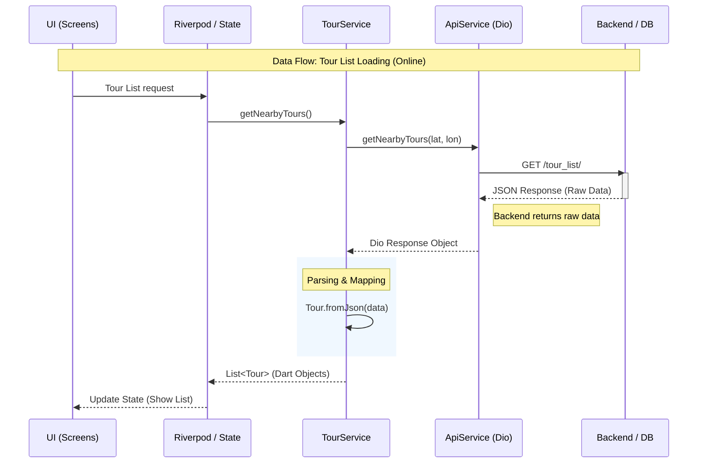
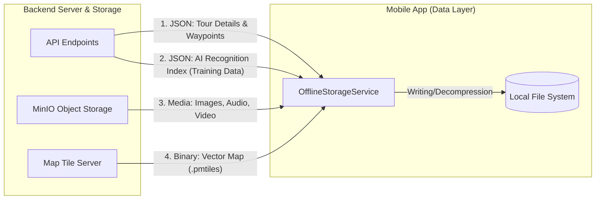
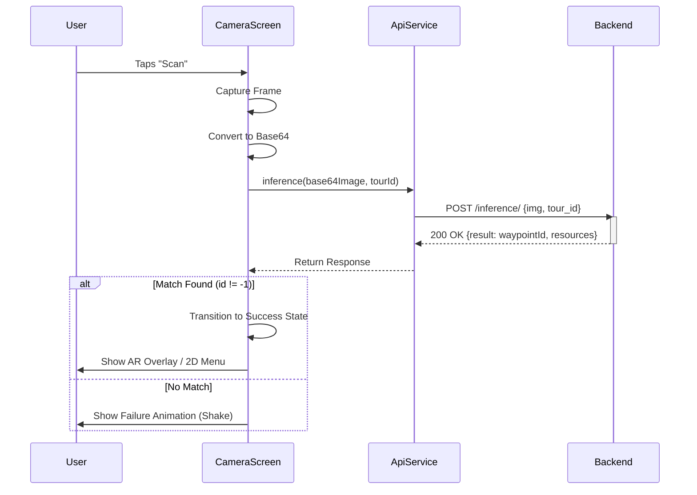
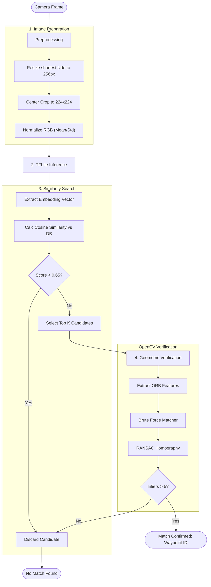
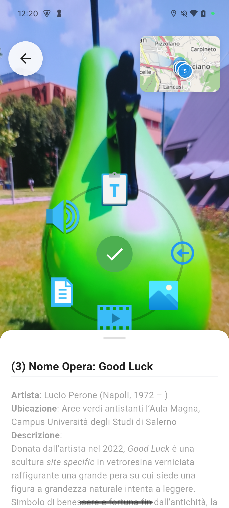
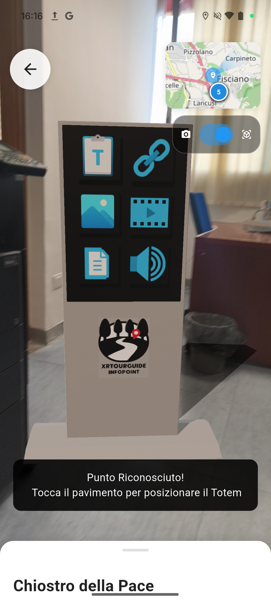

# XRTourGuide App - Technical Documentation

## 1. Project Overview

The **XR Tour Guide** is a Flutter-based mobile application that enables users to experience guided tours through physical locations. The application operates in two distinct modes—**Online** and **Offline**—allowing for seamless usage regardless of network connectivity.

The core innovation is its **Visual Recognition System**, which uses computer vision to identify real-world waypoints (landmarks, statues, buildings) and overlay digital content using **Augmented Reality (AR)**.



## 2. Architecture & Tech Stack

The application is built using a modular architecture to ensure scalability and maintainability.

* **Framework:** Flutter (Dart)
* **State Management:** `flutter_riverpod` for dependency injection and reactive state management. For example, `nearbyToursProvider` manages the list of available tours, while `tourServiceProvider` exposes the business logic.
* **Networking:** `dio` for HTTP requests with interceptors for authentication and base URL management.
* **Local Storage:** `flutter_secure_storage` for tokens and `path_provider` for file system access.

## 3. Data Management: Tours, Waypoints, & Sub-Tours

The application relies on a hierarchical data model managed by `TourService`. A crucial design pattern here is the normalization of nested server data into a recursive frontend model.

### 3.1 Data Hierarchy

* **Tour:** The root entity containing metadata (`title`, `category`, `totViews`, `rating`) and a list of top-level waypoints.
* It can be one of three types: **Exterior**, **Interior** or **Mixed**, each one with the major difference being if the waypoints of the tour are georeferenced or not.
* **Waypoint:** Represents a specific Point of Interest (POI). It contains:
* `id`, `title`, `description`: Display content.
* `latitude`, `longitude`: Geolocation for the map (Except for Interior Tours).
* `images`: A list of strings used for both display galleries and visual recognition training.


* **Sub-Tour (Recursive Waypoint):** The app handles complex locations (e.g., a museum with multiple rooms) marked as Mixed via **Sub-Tours**. In the frontend model, these are represented as `Waypoint` objects that contain a populated `subWaypoints` list.



### 3.2 Fetching & Parsing Logic (`TourService`)

The `TourService` is responsible for bridging the backend API and the UI. It performs a specific data transformation to handle sub-tours.

* **Fetching Waypoints:** When `getWaypointsByTour(tourId)` is called:
1. It fetches raw JSON from `/tour_waypoints/{id}`.
2. It first parses the standard `waypoints` list.
3. **Sub-Tour Transformation:** It checks for a `sub_tours` field in the response. If present, it iterates through them and transforms each sub-tour into a "Container Waypoint".
* The `sub_tour` metadata becomes the Container Waypoint's title and description.
* The `sub_tour`'s nested waypoints are parsed and assigned to the `subWaypoints` field of the Container Waypoint.
* This unifies the UI logic: everything is a `Waypoint`, but some have children.



### 3.3 Offline Management (`OfflineStorageService`)

The `OfflineStorageService` manages the complex task of replicating this hierarchy on the local file system.

* **Directory Structure:**
```text
/offline_tours_data
  /tour_{id}
    tour_data.json       # Serialized metadata
    training_data.json   # TFLite embeddings for recognition
    tour_{id}.pmtiles    # Vector map tiles
    /waypoint_{id}       # Assets for main waypoints
      image_0.jpg
      audio.mp3
    /waypoint_{sub_id}   # Assets for sub-waypoints (flat structure)

```


* **Download Logic:**
1. **Map Download:** Fetches the `.pmtiles` file from `/cut_map/{id}/`.
2. **Recursive Processing:** The `downloadTourOffline` method iterates through both main waypoints and sub-tours.
* For each waypoint (main or sub), it calls `_processWaypointOffline`.
* **Resource Fetching:** It downloads linked media (audio, video, PDF) and images. It handles URL rewriting to ensure `attachment=True` is passed to the API for direct file downloads.
* **Link Handling:** It specifically parses the `images` list to download gallery photos locally.





## 4. Visual Recognition System

The recognition system switches logic based on connectivity, but both paths feed into the same UI result.

### 4.1 Online Recognition (Cloud-Based)

* **Endpoint:** `/inference/`.
* **Logic:** Sends a Base64 image + `tour_id`. Returns the matched `waypointId` and a map of `available_resources` (e.g., `{audio: true, video: false}`). This map dynamically tells the UI which AR icons to spawn.



### 4.2 Offline Recognition (Edge AI)

* **Initialization:** Loads a custom **ResNet50** TFLite model and a tour-specific JSON index (`training_data.json`) containing embeddings and ORB features.
* **Pipeline:**
1. **Preprocessing:** Resize/Crop to 224x224 and normalize using ImageNet mean ([0.485, 0.456, 0.406]) and std ([0.229, 0.224, 0.225]).
2. **Embedding:** TFLite inference produces a vector.
3. **Search:** Cosine similarity finds top k candidates (Threshold: 0.65).
4. **Verification:** OpenCV (ORB + RANSAC Homography) extract and verifies the geometric match of features to prevent false positives.



## 5. UI Presentation Logic (`TourDetailScreen`)

The UI in `lib/tour_details_page.dart` is designed to handle the hierarchical data seamlessly.

* **Itinerary View:**
* Iterates through the `_waypoints` list.
* If a waypoint has `subWaypoints`, it creates a parent item and then recursively generates child items using `_buildSubWaypointItem`.
* **Numbering:** Implements logic to display "1" for main waypoints and "1.1", "1.2" for sub-waypoints.


* **Expand/Collapse:** Maintains specific state lists:
* `_expandedWaypoints`: Boolean list for top-level items.
* `_expandedSubWaypoints`: Map<int, List<bool>> to track the state of nested items independently.

## 6. Interaction Modes (ARCameraScreen)

Upon successfully recognizing a waypoint, the application offers two distinct modes for accessing content.

### 6.1 2D Overlay Mode (Screen-Space Interface)

This is the default mode designed for quick and immediate access to resources without requiring surface detection.

* **Visual Presentation**: A static 2D overlay appears on top of the camera feed. A central success indicator (animated green checkmark) is surrounded by a radial menu of 2D icons representing available resources (Text, Video, Audio, etc.).

* **Implementation**: The icons are standard Flutter widgets positioned using trigonometric calculations (center + radius * cos(angle)) relative to the screen's center. This ensures the UI is accessible regardless of the device's orientation or the environment's tracking quality.

### 6.2 Augmented Reality (AR) Mode (World-Space Interface)

Users can toggle this immersive mode to ground digital content in the physical world.

* **Totem Spawning**: Using ar_flutter_plugin, the app detects horizontal planes (floors/ground). Tapping a detected plane spawns a 3D "Totem" anchor (totem_base.glb) at that physical location.

* **3D Interaction**: Interactive 3D nodes (e.g., icon_video.glb, icon_pdf.glb) are instantiated and positioned to orbit the central totem. Tapping these virtual objects triggers the onNodeTap callback, which opens the corresponding resource in the DraggableScrollableSheet.





## 7. Key Services Summary

| Service | Description | Key Libraries |
| --- | --- | --- |
| **ApiService** | HTTP and HTTPS client configuration, Interceptors for Auth Token injection, Refresh Token logic, and base URL management. | `dio`, `secure_storage` |
| **TourService** | Facade for fetching tour data. Flattens backend `sub_tours` into recursive `Waypoint` objects. | `riverpod` |
| **OfflineStorage** | Manages file system (`path_provider`), downloads assets, and replicates the tour hierarchy locally. | `dio`, `path_provider` |
| **OfflineRecognition** | Handles TFLite model inference, JSON index loading, and OpenCV geometric verification. | `tflite_flutter`, `opencv_dart`, `image` |

## 8. Dependencies

Key packages specified in `pubspec.yaml`:

* [`flutter_riverpod`](https://pub.dev/packages/flutter_riverpod): State management.
* [`dio`](https://pub.dev/packages/dio): Networking.
* [`ar_flutter_plugin`](https://pub.dev/packages/ar_flutter_plugin): Augmented Reality.
* [`tflite_flutter`](https://pub.dev/packages/tflite_flutter): Machine Learning inference.
* [`opencv_dart`](https://pub.dev/packages/opencv_dart): Computer Vision algorithms.
* [`flutter_map`](https://pub.dev/packages/flutter_map) & `flutter_map_pmtiles`: Mapping.
* [`markdown_widget`](https://pub.dev/packages/markdown_widget): Rendering rich text content.
* [`archive`](https://pub.dev/packages/archive): Handling ZLib/GZip decompression for efficient resource transfer.