# XRCommunityServer - Identity Provider

<div align="center">

<br><br>
XRCommunityServer Identity Provider
</div>

The XRCommunityServer Identity Provider is a centralized authentication and authorization service that manages user identities and service credentials across multiple XRTourGuide instances. It provides a secure, scalable foundation for the XRTourGuide ecosystem by handling authentication, user management, and inter-service communication.

## Architecture Overview

The Identity Provider operates as a standalone FastAPI microservice that serves both web-based administration and RESTful API endpoints. It implements a secure authentication system using JWT tokens and manages service-to-service communication through API key authentication.

<div align="center">
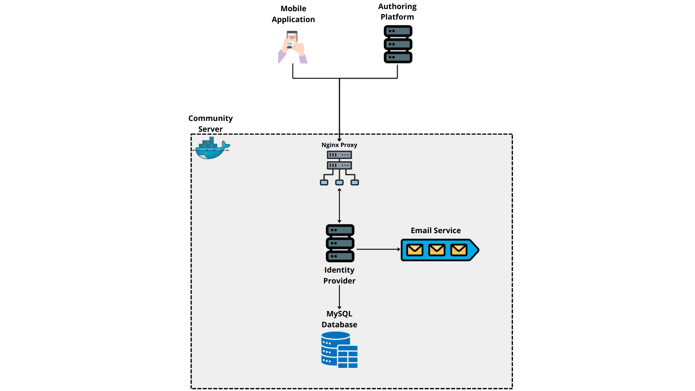
</div>

The architecture comprises:

- **FastAPI Application**: High-performance web framework for API endpoints
- **MySQL Database**: Persistent storage for users, services, and credentials
- **Email Service**: SMTP-based email delivery for verification and notifications
- **JWT Authentication**: Stateless token-based authentication system
- **Service Registry**: Management of registered XRTourGuide instances and third-party services
- **Admin Panel**: Web-based interface for service and user management

## Core Features

### User Authentication System

The Identity Provider implements a comprehensive authentication system that supports multiple authentication methods and user lifecycle management.

#### User Registration

New users can register through XRTourGuide client applications with email verification to ensure account security.

**Registration Flow:**

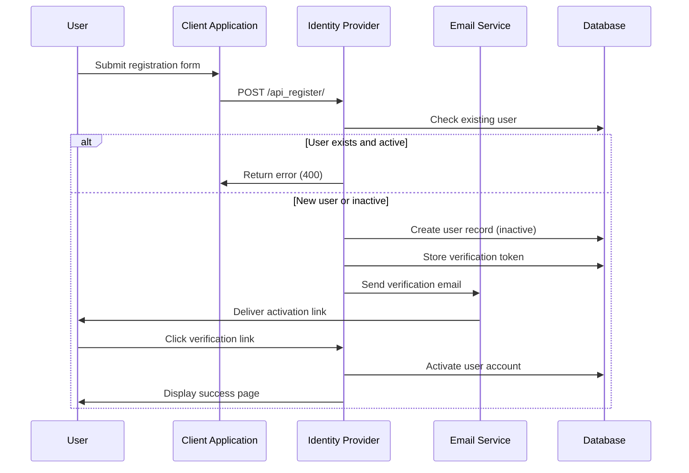

**Required Registration Information:**

- Username (unique)
- Email address (unique)
- Password (bcrypt hashed)
- First name (optional)
- Last name (optional)
- City (optional)
- Biography/description (optional)

**Security Features:**

- Email verification required before account activation
- Bcrypt password hashing with automatic salt generation
- Verification tokens expire after 24 hours
- Duplicate email/username prevention
- Inactive account cleanup for failed verifications

#### Standard Authentication

Registered users authenticate using email and password credentials to receive JWT access and refresh tokens.

**Authentication Flow:**

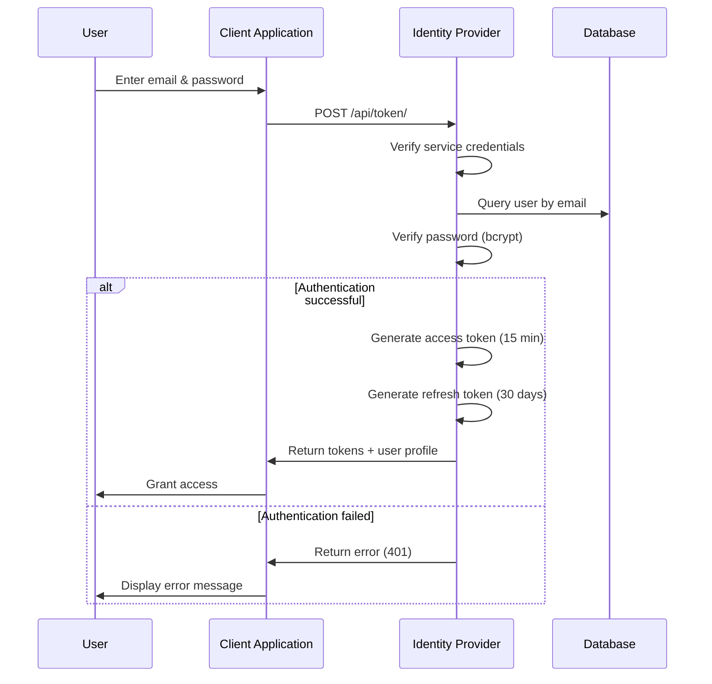

**JWT Token Structure:**

Access Token (15 minutes expiration):
```json
{
  "user_id": 123,
  "username": "john_doe",
  "email": "john@example.com",
  "exp": 1234567890,
  "type": "access"
}
```

Refresh Token (30 days expiration):
```json
{
  "user_id": 123,
  "username": "john_doe",
  "exp": 1234567890,
  "type": "refresh"
}
```

**Token Refresh Process:**

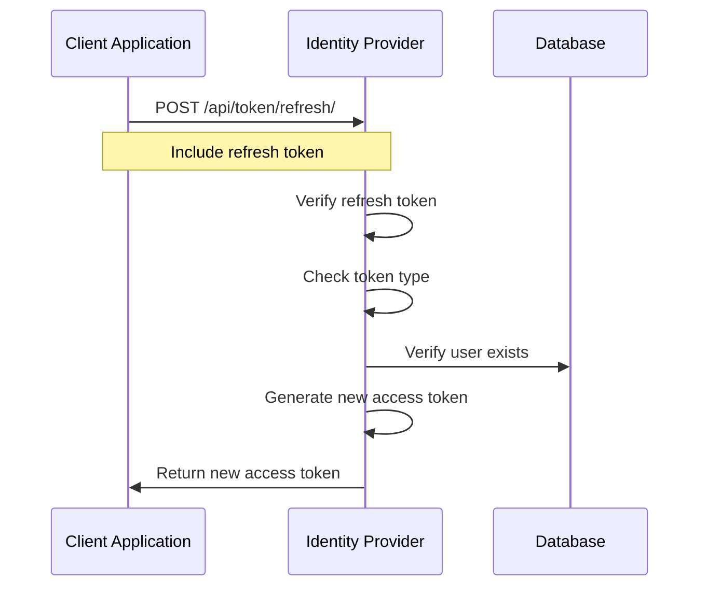

#### Google OAuth Authentication

Users can authenticate using their Google accounts for seamless single sign-on experience.

**Google OAuth Flow:**

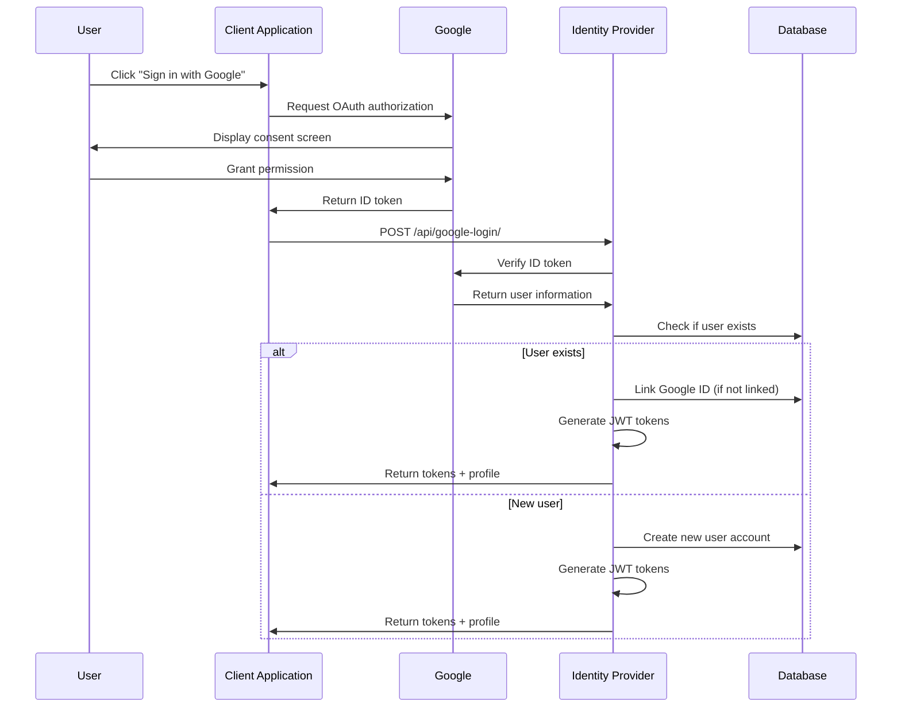

**Google Authentication Features:**

- Automatic account creation for new users
- Email verification bypass (Google-verified)
- Unique username generation with collision handling
- Google ID linking for existing accounts
- Secure random password generation for OAuth accounts

#### Password Reset

Users can securely reset their passwords through an email-based verification process.

**Password Reset Flow:**

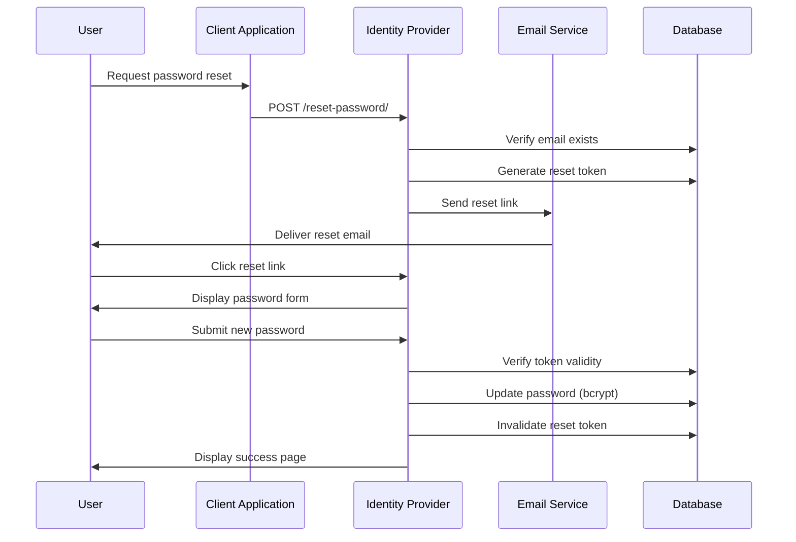

**Security Measures:**

- Reset tokens expire after 24 hours
- One-time use tokens
- Secure token generation using `secrets.token_urlsafe(32)`
- Email delivery confirmation before database commit
- Password confirmation required

### Service Management

The Identity Provider includes a comprehensive service registry that manages API credentials for XRTourGuide instances and third-party integrations.

#### Service Registration

Administrators can register new services through the web-based admin panel.

**Service Registration Flow:**

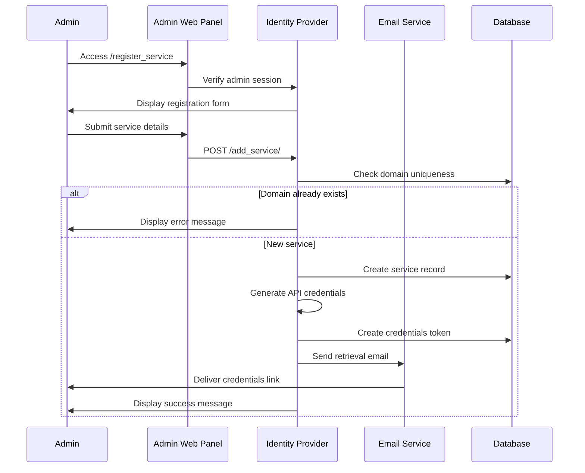

**Required Service Information:**

- Service name
- Domain/package identifier
- Requester email address
- Active status (enabled/disabled)

**Credential Generation:**

- API Key: 32-byte URL-safe random token
- API Secret: 32-byte URL-safe random token (bcrypt hashed)
- One-time retrieval token (24-hour expiration)
- Credentials never stored in plain text after generation

#### Credential Retrieval

Service administrators receive credentials through a secure, one-time retrieval process.

**Credential Retrieval Flow:**

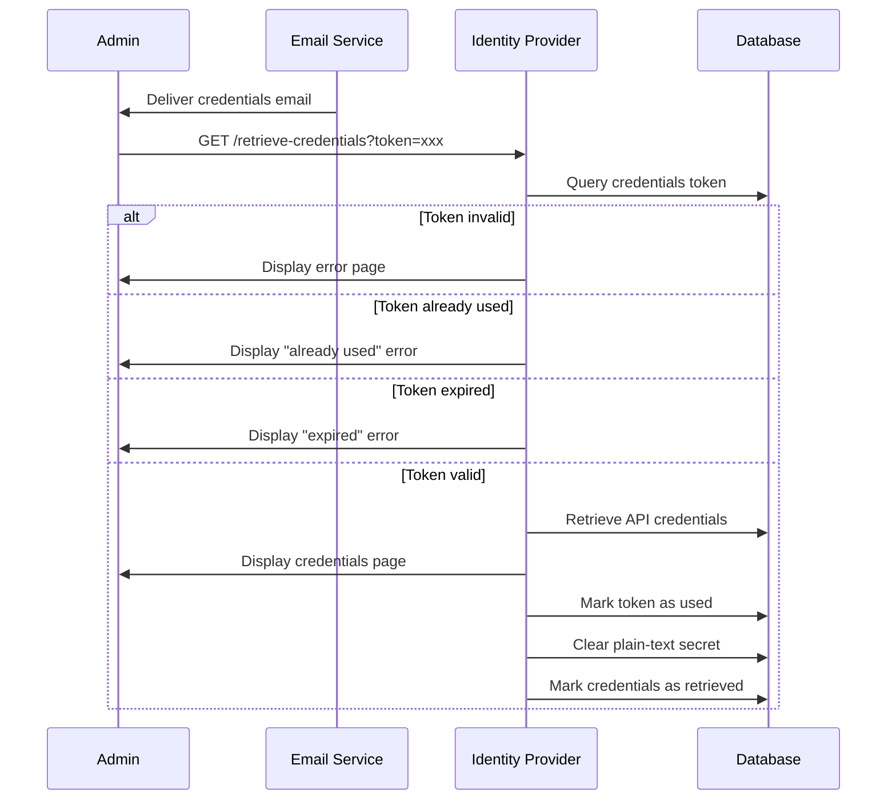

**Security Features:**

- One-time view only
- 24-hour token expiration
- Automatic plain-text secret deletion after viewing
- Email-based delivery ensures requester access
- Token invalidation prevents replay attacks

#### Service Authentication Methods

Services authenticate using one of two methods depending on their type:

**Method 1: API Key Authentication (Backend Services)**

```http
POST /api/token/ HTTP/1.1
Host: idp.example.com
X-API-Key: <api_key>
X-API-Secret: <api_secret>
Content-Type: application/json

{
  "email": "user@example.com",
  "password": "user_password"
}
```

**Method 2: Package Authentication (Mobile Applications)**

```http
POST /api/token/ HTTP/1.1
Host: idp.example.com
X-App-Package: com.example.xrtourguide
Content-Type: application/json

{
  "email": "user@example.com",
  "password": "user_password"
}
```

**Service Verification Process:**

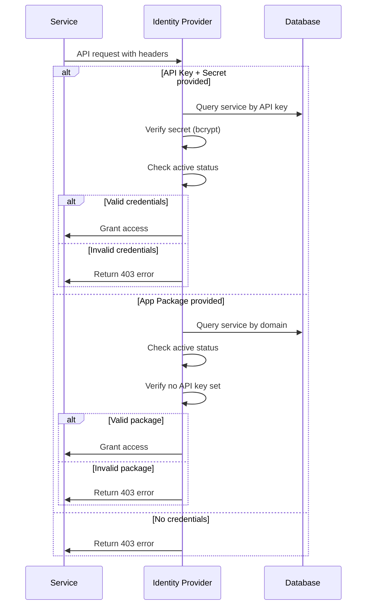

#### Service Administration

Administrators can manage registered services through the admin panel.

**Available Operations:**

| Operation | Endpoint | Description |
|-----------|----------|-------------|
| List Services | GET /list_services/ | View all registered services |
| Get Active Services | GET /get_services/ | Retrieve services with health checks |
| Toggle Status | POST /status_service/{id} | Enable/disable service access |
| Delete Service | POST /delete_service/{id} | Remove service from registry |
| Regenerate Credentials | POST /regenerate_credentials/{id} | Issue new API credentials |

**Service Status Management:**

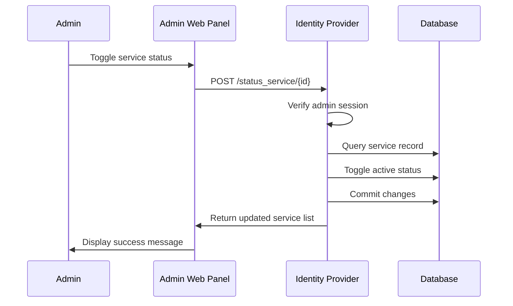

### User Profile Management

The Identity Provider provides endpoints for users to manage their profile information and account settings.

#### Profile Information

**Retrieve Profile:**

```http
GET /profile_detail/ HTTP/1.1
Host: idp.example.com
Authorization: Bearer <access_token>
```

**Response:**

```json
{
  "id": 123,
  "username": "john_doe",
  "email": "john@example.com",
  "first_name": "John",
  "last_name": "Doe",
  "city": "Naples",
  "description": "Tour guide and photographer"
}
```

**Update Profile:**

```http
POST /update_profile/ HTTP/1.1
Host: idp.example.com
Authorization: Bearer <access_token>
Content-Type: application/json

{
  "email": "newemail@example.com",
  "firstName": "John",
  "lastName": "Doe",
  "description": "Updated bio"
}
```

#### Password Management

**Change Password:**

```http
POST /update_password/ HTTP/1.1
Host: idp.example.com
Authorization: Bearer <access_token>
Content-Type: application/json

{
  "oldPassword": "current_password",
  "newPassword": "new_secure_password"
}
```

**Password Update Flow:**

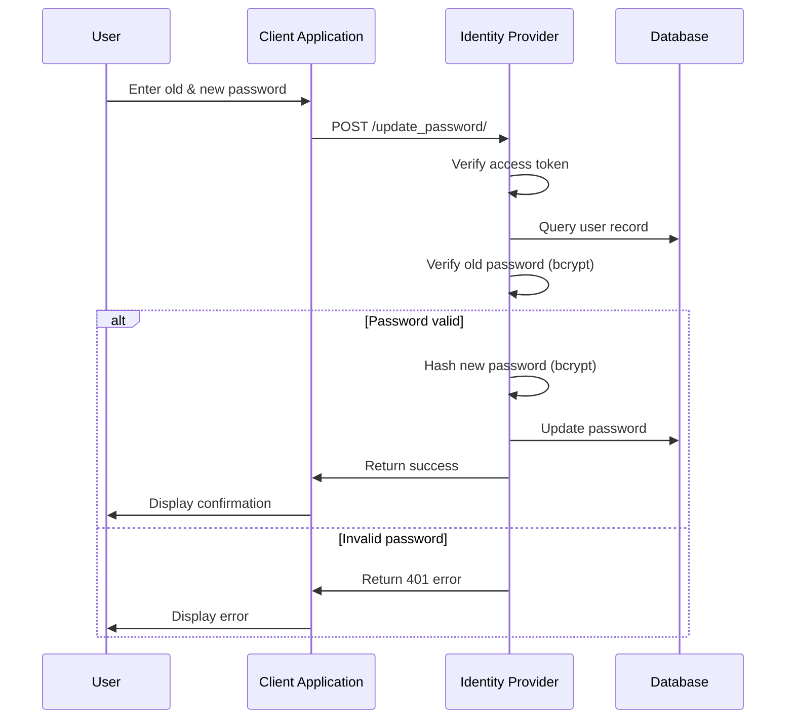

#### Account Deletion

Users can deactivate their accounts while preserving data for potential future reactivation.

```http
POST /delete_account/ HTTP/1.1
Host: idp.example.com
Authorization: Bearer <access_token>
Content-Type: application/json

{
  "password": "current_password"
}
```

**Account Deactivation Process:**

- Password verification required
- Account marked as inactive (not deleted)
- User data preserved in database
- Prevents future authentication
- Can be reactivated by administrator

### Token Verification

Services can verify user tokens to validate authentication state.

**Verify Token:**

```http
POST /api/verify/ HTTP/1.1
Host: idp.example.com
X-API-Key: <service_api_key>
X-API-Secret: <service_api_secret>
Content-Type: application/x-www-form-urlencoded

token=<user_access_token>
```

**Response (Valid Token):**

```json
{
  "valid": true,
  "id": 123,
  "user_id": 123,
  "username": "john_doe",
  "email": "john@example.com",
  "name": "John",
  "surname": "Doe",
  "city": "Naples",
  "description": "Tour guide",
  "exp": 1234567890,
  "type": "access"
}
```

**Response (Invalid Token):**

```json
{
  "valid": false,
  "status": 401
}
```

## API Reference

### Authentication Endpoints

| Endpoint | Method | Auth Required | Description |
|----------|--------|---------------|-------------|
| /api_register/ | POST | Service | Register new user account |
| /api/token/ | POST | Service | Authenticate user and receive tokens |
| /api/token/refresh/ | POST | Service | Refresh access token |
| /api/google-login/ | POST | Service | Authenticate via Google OAuth |
| /api/verify/ | POST | Service | Verify user access token |
| /verify-email | GET | None | Activate user account via email |
| /resend-verification/ | POST | Service | Resend verification email |
| /reset-password/ | POST | Service | Request password reset |
| /reset-password/ | GET | None | Display password reset form |
| /verify-reset-password/ | POST | None | Complete password reset |

### User Management Endpoints

| Endpoint | Method | Auth Required | Description |
|----------|--------|---------------|-------------|
| /profile_detail/ | GET | Bearer Token | Retrieve user profile |
| /update_profile/ | POST | Bearer Token | Update profile information |
| /update_password/ | POST | Bearer Token | Change user password |
| /delete_account/ | POST | Bearer Token | Deactivate user account |

### Service Management Endpoints (Admin Only)

| Endpoint | Method | Auth Required | Description |
|----------|--------|---------------|-------------|
| /list_services/ | GET | Session | List all registered services |
| /get_services/ | GET | Session | Get active services with health checks |
| /get_service/{id} | GET | Session | Get service domain by ID |
| /register_service | GET | Session | Display service registration form |
| /add_service/ | POST | Session | Register new service |
| /delete_service/{id} | POST | Session | Delete service |
| /status_service/{id} | POST | Session | Toggle service active status |
| /regenerate_credentials/{id} | POST | Session | Generate new API credentials |
| /retrieve-credentials | GET | Token | Retrieve service credentials (one-time) |

### Web Interface Endpoints

| Endpoint | Method | Description |
|----------|--------|-------------|
| / | GET | Login page |
| /login/ | POST | Admin authentication |

## Database Schema

### Users Table

```sql
CREATE TABLE users (
    id INT PRIMARY KEY AUTO_INCREMENT,
    username VARCHAR(50) UNIQUE NOT NULL,
    email VARCHAR(100) UNIQUE NOT NULL,
    password VARCHAR(100) NOT NULL,
    name VARCHAR(100),
    surname VARCHAR(100),
    active BOOLEAN DEFAULT FALSE,
    city VARCHAR(100),
    description VARCHAR(100),
    email_verified BOOLEAN DEFAULT FALSE,
    email_verification_token VARCHAR(255),
    email_verification_expires DATETIME,
    password_reset_token VARCHAR(255),
    password_reset_expires DATETIME,
    role VARCHAR(10) NOT NULL DEFAULT 'USER',
    google_id VARCHAR(255) UNIQUE,
    INDEX idx_email (email),
    INDEX idx_username (username),
    INDEX idx_google_id (google_id)
);
```

**User Roles:**

- `USER`: Standard user with basic permissions
- `ADMIN`: Administrator with service management capabilities

### Services Table

```sql
CREATE TABLE services (
    id INT PRIMARY KEY AUTO_INCREMENT,
    name VARCHAR(50) NOT NULL,
    domain VARCHAR(100) UNIQUE NOT NULL,
    active BOOLEAN DEFAULT TRUE,
    requester_email VARCHAR(100) NOT NULL,
    api_key VARCHAR(64) UNIQUE,
    api_secret_hash VARCHAR(100),
    created_at DATETIME DEFAULT CURRENT_TIMESTAMP,
    credentials_retrieved BOOLEAN DEFAULT FALSE,
    INDEX idx_api_key (api_key),
    INDEX idx_domain (domain)
);
```

### Service Credentials Tokens Table

```sql
CREATE TABLE service_credentials_tokens (
    id INT PRIMARY KEY AUTO_INCREMENT,
    token VARCHAR(64) UNIQUE NOT NULL,
    service_id INT NOT NULL,
    expires_at DATETIME NOT NULL,
    used BOOLEAN DEFAULT FALSE,
    created_at DATETIME DEFAULT CURRENT_TIMESTAMP,
    api_secret_plain VARCHAR(64),
    INDEX idx_token (token),
    FOREIGN KEY (service_id) REFERENCES services(id)
);
```

## Technology Stack

### Backend Framework:

- FastAPI for high-performance async API endpoints
- Python 3.8+ with type hints and Pydantic models
- SQLAlchemy ORM for database operations
- Jinja2 templates for web interface rendering

### Authentication & Security:

- JWT (JSON Web Tokens) via python-jose library
- Bcrypt password hashing via passlib
- Google OAuth 2.0 integration
- CORS middleware for cross-origin requests
- Secure token generation using Python's secrets module

### Database:

- MySQL 8.0 for persistent data storage
- Connection pooling for performance
- Indexed columns for query optimization

### Email Service:

- SMTP integration via smtplib
- HTML and plain-text email support
- Gmail SMTP server configuration
- Template-based email generation

### Session Management:

- Starlette session middleware
- Secure cookie-based sessions for admin panel
- HTTP-only cookies for enhanced security

### Development Tools:

- Uvicorn ASGI server for development and production
- Python-dotenv for environment configuration
- HTTPx for async HTTP client operations

## Integration Guide

### Client Application Integration

#### Step 1: Register Your Service

Contact the Identity Provider administrator to register your application and receive:

- API Key
- API Secret
- Service activation confirmation

#### Step 2: Configure Your Application

```python
# env.py
IDP_BASE_URL = "https://idp.yourdomain.com"
IDP_API_KEY = "your-api-key"
IDP_API_SECRET = "your-api-secret"
```

## Contributing

We welcome contributions to improve the XRCommunityServer Identity Provider. Please follow these guidelines:

### Contribution Guidelines

**1. Fork the Repository**

```bash
git clone https://github.com/isislab-unisa/XRTourGuide.git
cd community_server
```

**2. Create Feature Branch**

```bash
git checkout -b feature/your-feature-name
```

**3. Make Changes**

- Follow existing code style and conventions
- Add tests for new functionality
- Update documentation as needed
- Ensure all tests pass

**4. Commit Changes**

```bash
git commit -m "Add feature: description of changes"
```

**5. Push and Create Pull Request**

```bash
git push origin feature/your-feature-name
```

### Code Standards

- Follow PEP 8 style guide for Python code
- Use type hints for function parameters and return values
- Write descriptive docstrings for all functions and classes
- Keep functions focused and modular
- Add unit tests for new features
- Update API documentation for endpoint changes

## License

This project is licensed under the MIT License. See the LICENSE file for complete terms and conditions.

## Funding and Acknowledgments

This project has received funding from the European Union's Horizon 2020 research and innovation programme under the FUTURAL initiative. We gratefully acknowledge the support and collaboration of all project partners and contributors.

## Resources and Contact

### Project Resources:

- **Official Website**: [isislab-unisa.github.io/XRTourGuide](https://isislab-unisa.github.io/XRTourGuide)
- **Documentation**: Available in the `/docs` directory
- **API Documentation**: Interactive API explorer at `/docs` (FastAPI auto-generated)

### Support and Community:

- **Issue Tracker**: GitHub Issues
- **Feature Requests**: Submit via GitHub Issues with the `enhancement` label
- **Bug Reports**: Submit via GitHub Issues with the `bug` label
- **Security Issues**: Report privately to isislab.unisa@gmail.com

For direct inquiries about the Identity Provider, please contact the development team through the ISISLab website or GitHub repository.