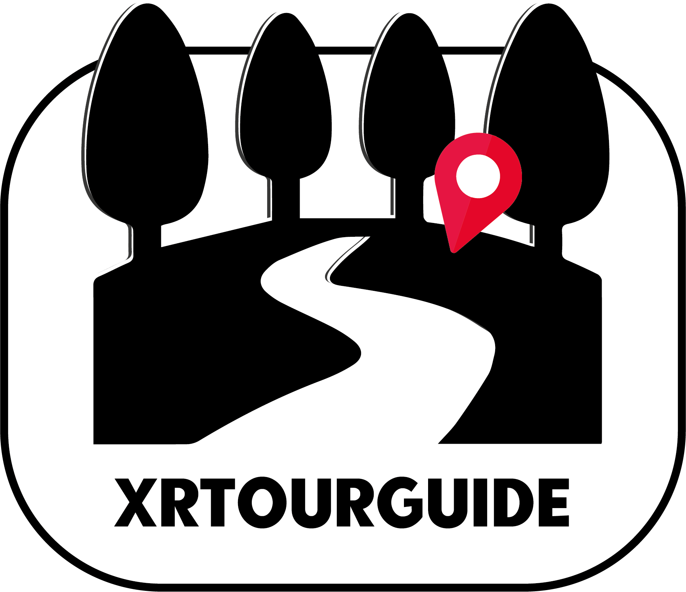
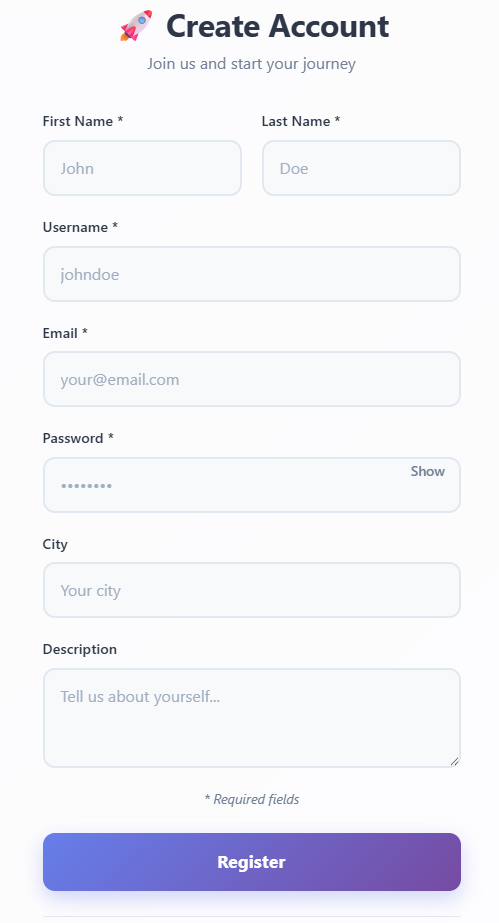
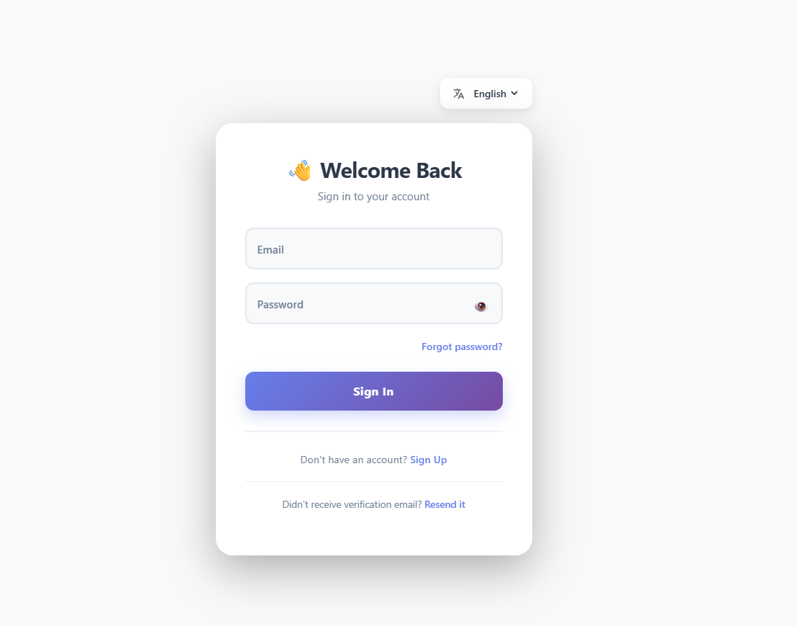
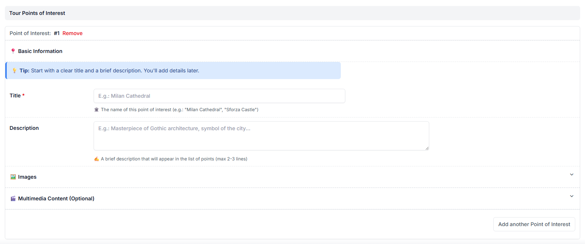

# XRTourGuide

  

**Guiding Real-Life Experiences with XR Content**

*Enriching reality with immersive media insights using Extended Reality (XR) and Artificial Intelligence (AI) to empower rural communities.*

[Website](https://isislab-unisa.github.io/XRTourGuide/) • [FUTURAL Project](https://futural-project.eu/it/)

---

## About

**XRTourGuide** is an innovative sub-project of the EU-funded [FUTURAL initiative](https://futural-project.eu/it/), designed to create immersive virtual tours that enrich rural communities and enhance cultural heritage preservation. By combining Extended Reality (XR) technologies with Artificial Intelligence, XRTourGuide empowers local communities to create, share, and experience interactive tours of their cultural landmarks, natural sites, and historical treasures.

### The Challenge

Many rural regions rich in cultural heritage face significant obstacles:

- **Limited Accessibility**: Cultural sites struggle to remain open due to staff shortages and deteriorating infrastructure
- **Insufficient Services**: Lack of basic visitor amenities discourages tourism
- **Low Visibility**: Weak regional branding and promotional efforts keep areas "off the map"
- **Poor Information Dissemination**: Historical and practical information about sites is fragmented and difficult to access

### Our Solution

XRTourGuide provides a comprehensive online platform that enables communities to create and share immersive XR virtual tours, transforming how people explore and engage with rural territories. The platform combines:

- **Web-based Authoring Tools** for intuitive content creation
- **Mobile Applications** for discovering and experiencing tours on-location
- **AI-Powered Visual Recognition** to trigger contextual, location-aware information
- **Community Co-Creation** through active participation of local residents, cultural organizations, and tourism boards

---

## Key Features

### User Authentication

#### Sign Up
New users register through the web application with their profile information stored in the XRCommunityServer, which manages multiple XRTourGuide instances to create a unified community.

**Required Information:**
- First Name
- Last Name
- Username
- Email
- Password
- City
- Description (Bio)

**Process:**
1. User submits registration form
2. Information is sent to the Identity Provider (IdP)
3. Activation link is sent to the user's email
4. User activates account via email link

#### Sign In
Registered users access the platform through a secure authentication flow.

**Authentication Flow:**
1. User enters email and password
2. Credentials are validated by the Identity Provider
3. Upon successful authentication, a JWT token is issued
4. Token is used for subsequent authenticated requests

### 🗺️ Tour Creation

The core functionality of the web application revolves around creating and managing immersive tours. Tour creators can define rich, multi-waypoint experiences.

#### Step 1: Tour Information
Define the basic details of your tour including name, description and category.

#### Step 2: Area Selection
Select the geographic area where your tour takes place using an interactive map interface.

#### Step 3: Add Waypoints
Add individual waypoints (stops) along the tour route, each with its own content and media like: images, video, tracks, pdf, markdown content

**Waypoint Features:**
- Geographic coordinates (GPS location)
- Title and description
- Multimedia content (images, videos, 3D models)
- AI visual recognition triggers
- Historical and contextual information
- Points of interest markers

---

## API Endpoints

The web application exposes RESTful API endpoints used by the mobile application to retrieve tour data, submit reviews, and interact with AI services.

### Tour & Waypoint Management

| Endpoint | Method | Description |
|----------|--------|-------------|
| `/tour_waypoints/<tour_id>/` | GET | Retrieve all waypoints for a specific tour |
| `/load_model/<tour_id>/` | GET | Load the AI recognition model for a tour |
| `/get_waypoint_resources/` | GET | Fetch multimedia resources for a waypoint |
| `/cut_map/<tour_id>/` | GET | Generate a cropped map view for the tour area |

### User Interactions

| Endpoint | Method | Description |
|----------|--------|-------------|
| `/create_review/` | POST | Submit a review for a tour |
| `/get_reviews_by_user/` | GET | Retrieve all reviews created by a user |
| `/increment_view_count/` | POST | Track tour views/visits |

### AI Services

| Endpoint | Method | Description |
|----------|--------|-------------|
| `/inference/` | POST | Perform visual recognition inference on uploaded images |
| `/download_model/` | GET | Download AI model for offline mobile use |

---

## Contributing

We welcome contributions from the community! XRTourGuide is built on the principle of co-creation, and your input helps make the platform better for everyone.

### How to Contribute

1. Fork the repository
2. Create a feature branch (`git checkout -b feature/amazing-feature`)
3. Commit your changes (`git commit -m 'Add amazing feature'`)
4. Push to the branch (`git push origin feature/amazing-feature`)
5. Open a Pull Request

---

## License

This project is licensed under the MIT License - see the [LICENSE](../LICENSE) file for details.

---

## Acknowledgments

This project has received funding from the European Union's Horizon 2020 research and innovation programme under the [FUTURAL](https://futural-project.eu/it/) initiative.

---

## Contact & Resources

- **Project Website**: [isislab-unisa.github.io/XRTourGuide](https://isislab-unisa.github.io/XRTourGuide/)
- **FUTURAL Project**: [futural-project.eu](https://futural-project.eu/it/)
- **Research Group**: [ISISLab - UNISA](https://www.isislab.it/)
- **GitHub Issues**: [Report bugs or request features](https://github.com/isislab-unisa/XRTourGuide/issues)

Issue Tracker**: [GitHub Issues](https://github.com/isislab-unisa/XRTourGuide/issues)