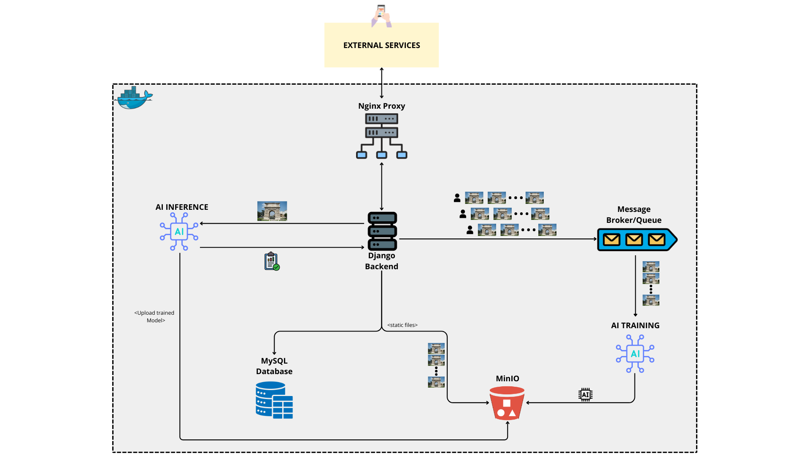
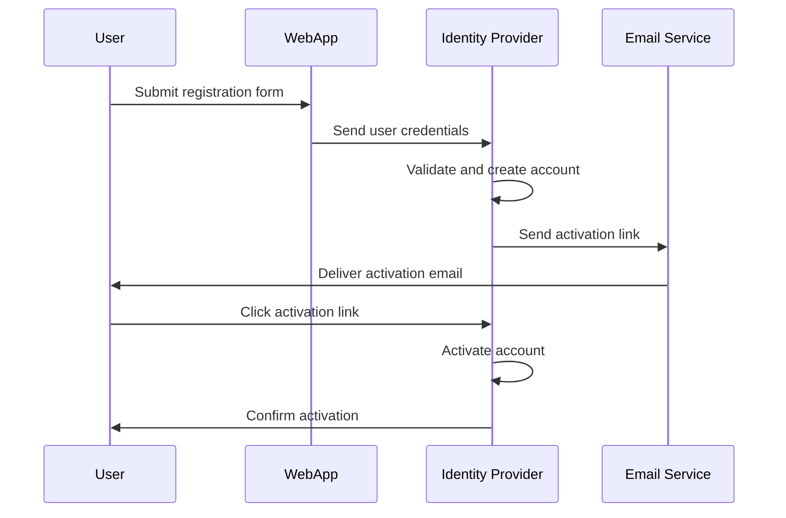
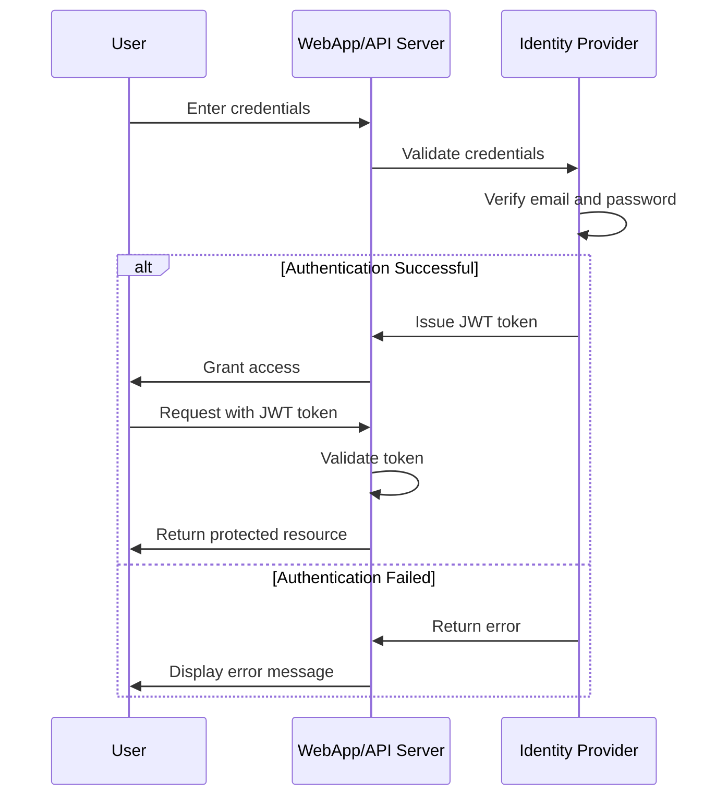
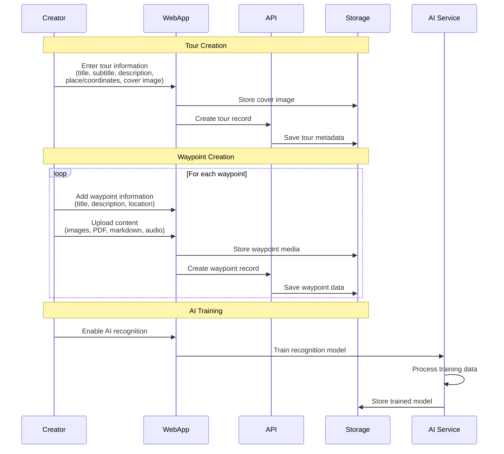
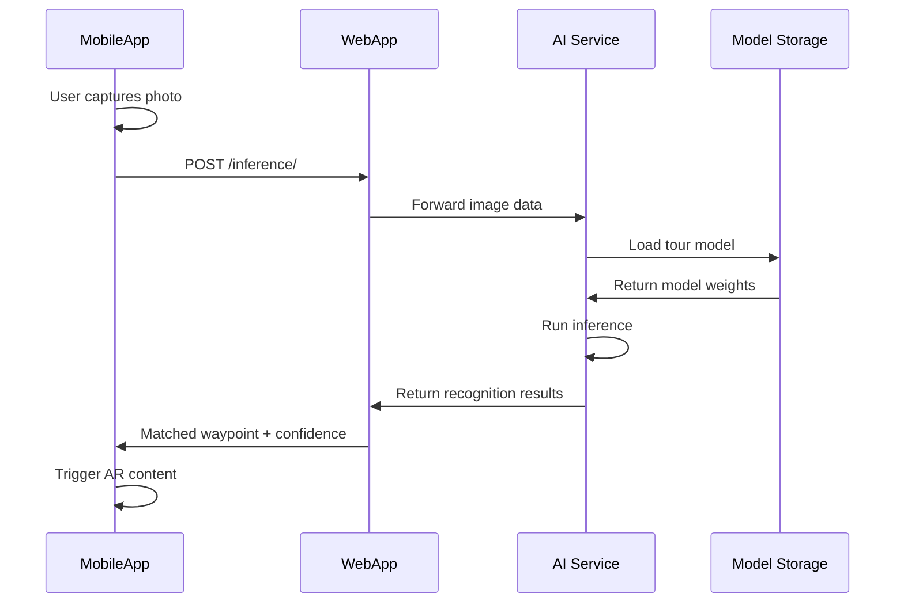

# XRTourGuide

  

# XRTourGuide Authoring Platform

The Authoring Platform is a comprehensive web-based system that provides REST API functionalities for both the web frontend and mobile application. It enables users to create, manage, and experience immersive location-based tours enhanced with augmented reality capabilities.

## Architecture Overview

Our solution is built on a microservices architecture, where each service maintains distinct responsibilities. The platform consists of several interconnected components that work together to deliver a seamless tour creation and consumption experience.

The architecture comprises:

- **Web Application**: Tour authoring interface for content creators
- **Mobile Application**: End-user tour experience platform
- **Identity Provider**: Centralized authentication and user management
- **XRCommunityServer**: Multi-instance federation server managing the XRTourGuide community
- **AI Services**: Visual recognition and inference capabilities
- **Media Storage**: Multimedia content management system

## Core Features

### User Authentication

The platform implements a secure authentication system managed through the XRCommunityServer, which coordinates multiple XRTourGuide instances to create a unified community experience.

#### Registration Process

New users register through the web application with their profile information stored in the XRCommunityServer.

**Required Information:**
- First Name
- Last Name
- Username
- Email Address
- Password
- City
- Biography/Description

**Registration Flow:**

**Process Steps:**
1. User completes and submits the registration form
2. Application forwards information to the Identity Provider
3. Identity Provider validates data and creates account
4. Activation link is sent to the registered email address
5. User activates account by following the email link
6. Account becomes active and ready for use

#### Authentication Process

Registered users access the platform through a secure JWT-based authentication flow.

**Authentication Flow:**

**Authentication Steps:**
1. User submits email and password credentials
2. Identity Provider validates credentials against stored records
3. Upon successful validation, a JWT token is generated and issued
4. Token is stored client-side and included in subsequent API requests
5. API endpoints validate the token before processing requests

### Tour Creation

The platform's primary functionality enables content creators to design and publish comprehensive, location-based tours with multiple waypoints and rich multimedia content.

#### Step 1: Tour Information

Define the fundamental attributes of your tour, including identification, description, and categorization.

**Tour Attributes:**
- Tour name/title
- Detailed description
- Category classification
- Difficulty level
- Estimated duration
- Target audience

#### Step 2: Geographic Area Selection

Specify the geographic boundaries of your tour using an interactive map interface.

**Area Definition Features:**
- Interactive map selection tool
- Polygon drawing for custom boundaries
- Area size validation
- Geographic coordinate specification
- Map layer customization

#### Step 3: Waypoint Configuration

Add and configure individual waypoints along the tour route, each containing location-specific content and multimedia resources.

**Waypoint Components:**
- GPS coordinates (latitude, longitude)
- Waypoint title and description
- Multimedia attachments (images, videos, audio tracks, PDFs)
- 3D models and AR content
- AI visual recognition triggers
- Historical and contextual information
- Points of interest references
- Markdown-formatted content

**Tour Creation Workflow:**

## API Reference

The platform exposes a comprehensive RESTful API used by the mobile application and third-party integrations.

### Tour and Waypoint Management

| Endpoint | Method | Description | Parameters |
|----------|--------|-------------|------------|
| `/tour_waypoints/<tour_id>/` | GET | Retrieve all waypoints associated with a specific tour | `tour_id`: Tour identifier |
| `/load_model/<tour_id>/` | GET | Load the AI recognition model trained for a tour | `tour_id`: Tour identifier |
| `/get_waypoint_resources/` | GET | Fetch multimedia resources attached to waypoints | `waypoint_id`: Waypoint identifier |
| `/cut_map/<tour_id>/` | GET | Generate a cropped map view for the tour's geographic area | `tour_id`: Tour identifier |

### User Interaction and Analytics

| Endpoint | Method | Description | Request Body |
|----------|--------|-------------|--------------|
| `/create_review/` | POST | Submit a user review for a completed tour | `tour_id`, `rating`, `comment`, `user_token` |
| `/get_reviews_by_user/` | GET | Retrieve all reviews created by a specific user | `user_id` (query parameter) |
| `/increment_view_count/` | POST | Track and increment tour view/visit statistics | `tour_id`, `user_token` |

### Artificial Intelligence Services

| Endpoint | Method | Description | Request Body |
|----------|--------|-------------|--------------|
| `/inference/` | POST | Perform visual recognition inference on uploaded images | `image` (file), `tour_id`, `model_version` |
| `/download_model/` | GET | Download trained AI model for offline mobile use | `tour_id`, `platform` (iOS/Android) |

**AI Inference Flow:**

## Technology Stack

**Backend:**
- Django framework with Django REST Framework (DRF)
- RESTful API architecture
- JWT-based authentication
- MySQL 8.0 database
- Celery for asynchronous task processing
- Redis as message broker and cache
- MinIO for S3-compatible object storage (media files, AI models)

**Web Server & Reverse Proxy:**
- Nginx as reverse proxy and static file server
- SSL/TLS certificate management with Certbot

**Frontend:**
- HTML, CSS, and JavaScript
- Responsive web design
- Interactive mapping libraries

**AI/ML Services:**
- PyTorch for deep learning models
- FastAPI for AI inference and training microservices
- Computer vision pipeline for image recognition
- Separate containerized services for model training and inference

**Infrastructure:**
- Docker containerization
- Docker Compose orchestration
- Custom network configuration for service isolation
- Health checks and automatic restart policies

## Development and Contribution

We welcome and encourage contributions from the developer community. XRTourGuide is built on principles of open collaboration and co-creation.

### Contributing Guidelines

**Getting Started:**

1. Fork the repository to your GitHub account
2. Clone your fork locally: `git clone https://github.com/YOUR_USERNAME/XRTourGuide.git`
3. Create a feature branch: `git checkout -b feature/descriptive-feature-name`
4. Make your changes following the project's coding standards
5. Write or update tests as necessary
6. Commit your changes: `git commit -m 'Add descriptive commit message'`
7. Push to your fork: `git push origin feature/descriptive-feature-name`
8. Open a Pull Request with a clear description of changes

**Code Standards:**
- Follow existing code style and conventions
- Write clear, self-documenting code
- Include comments for complex logic
- Ensure all tests pass before submitting
- Update documentation for new features

**Pull Request Process:**
- Provide a detailed description of changes
- Reference related issues if applicable
- Ensure CI/CD checks pass
- Respond to review feedback promptly
- Maintain a clean commit history

## License

This project is licensed under the MIT License. See the [LICENSE](../LICENSE) file for complete terms and conditions.

## Funding and Acknowledgments

This project has received funding from the European Union's Horizon 2020 research and innovation programme under the [FUTURAL](https://futural-project.eu/it/) initiative. We gratefully acknowledge the support and collaboration of all project partners and contributors.

## Resources and Contact

**Project Resources:**
- **Official Website**: [isislab-unisa.github.io/XRTourGuide](https://isislab-unisa.github.io/XRTourGuide/)
- **Documentation**: Available in the `/docs` directory
- **API Documentation**: Interactive API explorer at `/api/docs`

**Research and Development:**
- **FUTURAL Project**: [futural-project.eu](https://futural-project.eu/it/)
- **ISISLab Research Group**: [www.isislab.it](https://www.isislab.it/)
- **University of Salerno**: Department of Computer Science

**Support and Community:**
- **Issue Tracker**: [GitHub Issues](https://github.com/isislab-unisa/XRTourGuide/issues)
- **Feature Requests**: Submit via GitHub Issues with the `enhancement` label
- **Bug Reports**: Submit via GitHub Issues with the `bug` label
- **Discussions**: [GitHub Discussions](https://github.com/isislab-unisa/XRTourGuide/discussions)

For direct inquiries, please contact the development team through the ISISLab website or GitHub repository.